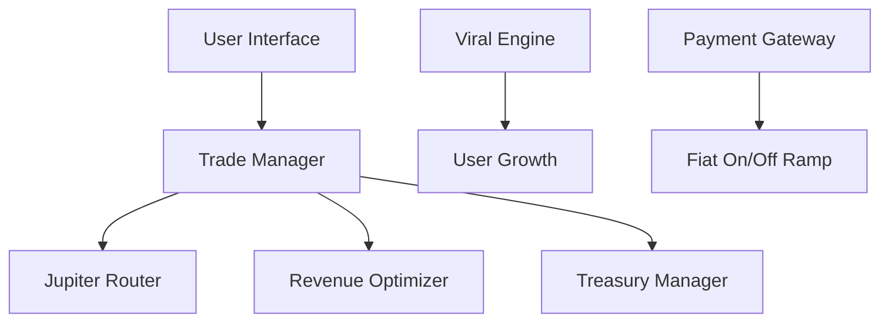
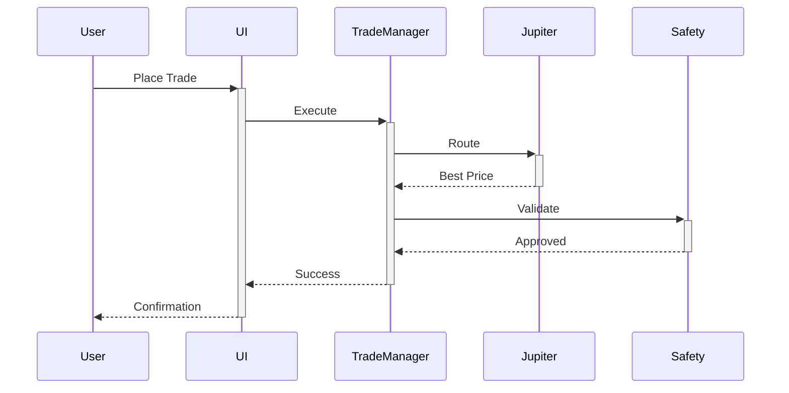
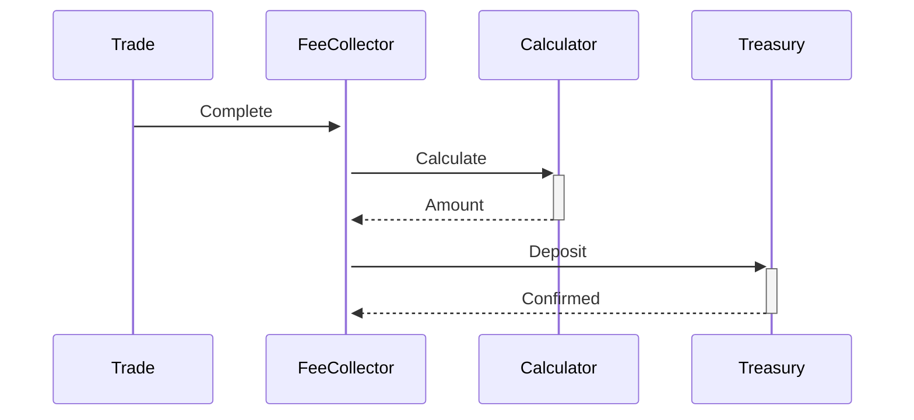

# ZibFin Architecture

## System Overview

ZibFin is a high-performance crypto trading platform built on Solana, designed for mass adoption in India.

## Core Components

### 1. Trade Execution Layer

- **Trade Manager**: Handles trade execution and routing
- **Jupiter Integration**: Finds best trading routes
- **Fee Calculator**: Dynamic fee structure
- **Safety Checker**: Trade validation and protection

### 2. Revenue Layer

- **Revenue Optimizer**: Maximizes platform revenue
- **Treasury Manager**: Manages platform funds
- **Fee Collector**: Automatic fee collection
- **Profit Maximizer**: Optimizes trading spreads

### 3. Growth Layer

- **Viral Engine**: Drives user growth
- **Referral System**: Manages referrals
- **Contest Manager**: Handles trading contests
- **Community Engine**: Engagement features

### 4. User Layer

- **Auth System**: User authentication
- **KYC Manager**: Verification process
- **Wallet Connect**: Crypto wallets
- **Fiat Gateway**: INR deposits/withdrawals

## Data Flow

1. **Trade Flow**

2. **Revenue Flow**

## Security Architecture

### 1. Transaction Security
- Multi-sig treasury
- Rate limiting
- Fraud detection
- Slippage protection

### 2. User Security
- 2FA authentication
- KYC verification
- Wallet validation
- Activity monitoring

### 3. Platform Security
- DDoS protection
- Rate limiting
- Input validation
- Error handling

## Scalability

### 1. Infrastructure
- Load balancing
- Auto-scaling
- Cache layers
- Queue systems

### 2. Performance
- Response time < 100ms
- 1000+ trades/second
- 99.9% uptime
- Real-time updates

## Monitoring

### 1. System Metrics
- Trade volume
- User growth
- Revenue
- Performance

### 2. User Metrics
- Engagement
- Retention
- Conversion
- Satisfaction

## Testing Strategy

### 1. Unit Tests
- Components
- Functions
- Classes
- Utils

### 2. Integration Tests
- APIs
- Services
- Workflows
- End-to-end

### 3. Performance Tests
- Load testing
- Stress testing
- Scalability
- Reliability

## Deployment

### 1. Environment
- Development
- Staging
- Production
- Backup

### 2. Process
- CI/CD pipeline
- Automated tests
- Code review
- Deployment checks

## Future Scalability

1. **Horizontal Scaling**
   - Multiple instances
   - Load balancing
   - Database sharding
   - Cache distribution

2. **Feature Expansion**
   - More trading pairs
   - Advanced features
   - API access
   - Mobile apps

3. **Geographic Expansion**
   - Multiple regions
   - Local partnerships
   - Language support
   - Payment methods
